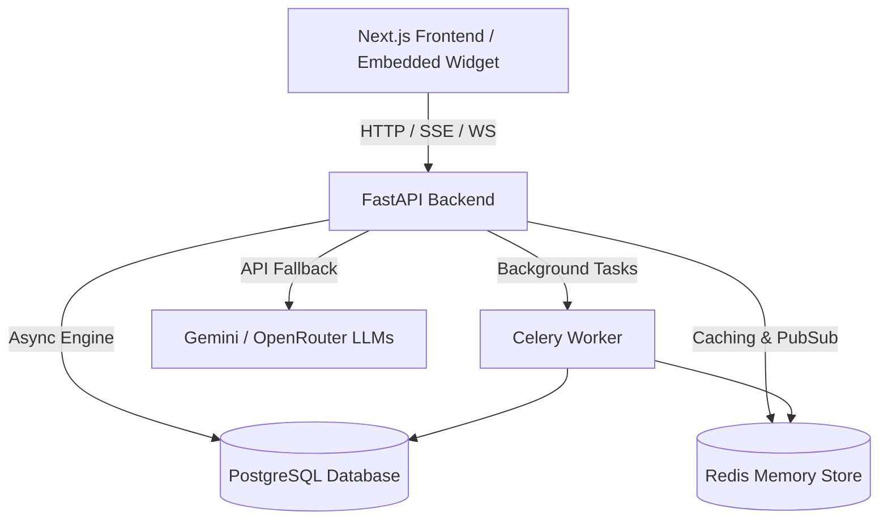

# AgentFlow AI
### Autonomous AI Appointment Setter & Lead Qualification SaaS Platform

[](https://opensource.org/licenses/MIT)
[](https://fastapi.tiangolo.com/)
[](https://nextjs.org/)
[](https://www.postgresql.org/)

---

AgentFlow AI is a state-of-the-art, multi-tenant conversational SaaS platform designed to qualify leads, book appointments, and manage client onboarding autonomously. Tailored for high-growth brands (such as Al Huda Gallery), it blends deterministic safety nets with modern LLMs to deliver human-grade scheduling conversations, automatic translation corrections, and detailed analytics.

---

## 🚀 Core Features & Specifications

### 🤖 Autonomous Conversations & Lead Qualification
- **Dynamic Context Engines:** Leverages Gemini (with auto-fallback to OpenRouter free models like Llama-3.3-70b/Mistral-7b) to handle appointment booking, FAQs, and profiling.
- **Intelligent Profiling:** Automatically extracts customer names, email addresses, phone numbers, and qualification details from natural text.

### 📝 Auto-Logging & Corrections Loop (T029a / T029b)
- **Pending Review Pipeline:** When conversations encounter translation mismatches, hallucinations, or corrections, a row is automatically logged in the `corrections` database table with `was_edited=null`.
- **Admin Reconciliation UI:** Business administrators can review, edit, or mark corrections as resolved via the SaaS dashboard (`POST /api/v1/corrections/{id}/review`). Approved modifications are fed back to the AI context to improve future accuracy.

### 🛡️ Safety Escalation Backstop (T090)
- **Deterministic Sentiment Interceptor:** A local safety layer scans incoming messages for frustration, negative sentiment, refund requests, or scam attempts.
- **Multilingual Support:** Fully loaded with keyword sentiment definitions for **English**, **Urdu (اردو)**, and **Roman Urdu** (transliterated Urdu) to immediately trigger human agent handoff when frustration is detected, ensuring reliable customer service.

### 📊 SaaS Analytics Dashboard
- **Interactive KPI Visualizations:** Live stats showing total leads, booked leads, booking conversion percentages, no-show rates, and repeat customer retention.
- **Onboarding Pipeline & Bottlenecks:** Tracks onboarding progression across registration, business configuration, availability setup, and widget embedding, showing active bottlenecks.

### 🔒 Enterprise Resilience & Security
- **Strict Tenant Isolation:** Restricts database sessions to the authenticated tenant (using tenant keys/RLS scoping).
- **Billing Security Gate:** Auto-locks write access to API services if a tenant's billing status becomes past-due or canceled.
- **JWT Key Rotation:** Supports secure token rotation with secondary previous key validation (`JWT_PREVIOUS_SECRET`).
- **Distributed Throttling:** Multi-layered rate limits for public API endpoints using Redis token bucket middleware.

---

## 🛠️ Architecture & Tech Stack



### Backend (`/backend`)
- **Web Framework:** FastAPI (Asynchronous ASGI server)
- **Task Queue:** Celery (Asynchronous background workers)
- **Caching & Rate Limiting:** Redis
- **Database ORM:** SQLAlchemy with Alembic Migrations
- **AI Integration:** Google GenAI SDK & OpenRouter APIs

### Frontend (`/frontend`)
- **Framework:** Next.js 14 (TypeScript App Router)
- **Styling:** TailwindCSS
- **State Management:** Zustand
- **Data Fetching:** React Query (TanStack)
- **Data Visualization:** Recharts

---

## 📖 User Manual & Operational Guide

### 1. Account Onboarding & Configuration
When a new brand registers, they are guided through a structured onboarding flow:
1. **Business Profile:** Setup brand name, industry, and main operational address.
2. **Services Setup:** Define the appointment services offered, duration (e.g., 30 mins, 60 mins), and price.
3. **AI Persona & FAQ Tuning:** Enter brand-specific guidelines, target audience, and commonly asked questions to program the agent's knowledge base.
4. **Availability Grid:** Map working hours, lunch hours, and timezone constraints.
5. **Widget Embed Code:** Copied script tag to mount the conversational interface on their storefront.

### 2. Conversational Widget Integration
To embed the live agent widget on your site, add the following script block to the `<body>` element:
```html
<script 
  src="https://backend-production-1681f.up.railway.app/static/widget.js" 
  data-tenant-key="your_tenant_public_key"
  async>
</script>
<div id="agentflow-chat-widget"></div>
```
*The widget automatically spins up an isolated conversation thread, queries availability slots, and allows customers to reserve appointments directly in the chat bubble.*

### 3. Corrections Review Workflow
1. Navigate to the **Corrections** tab in the SaaS admin portal.
2. The UI lists all pending auto-logged correction requests.
3. Select a correction card to see the original customer message and the AI draft interpretation.
4. If correct, hit **Approve**. If there is a translation/logical error, edit the values and hit **Submit Review**. The correction is processed, training/scoping files are synced, and the row disappears from pending.

### 4. Human Handoff Queue
When the Urdu/English safety backstop detects frustration (e.g., *"یہ بہت خراب سروس ہے"* or *"Connect me to a manager"*):
1. The AI immediately calls `escalate_to_human`.
2. The chat window in the widget notifies the customer: *"Connecting you to a human agent..."*
3. The conversation changes status to `escalated` and is added to the **Human Queue** tab on the dashboard, where support staff can take over.

---

## 💻 Local Development Setup

To run AgentFlow AI locally with the complete ecosystem:

### 1. Requirements
Ensure you have Docker and Docker Compose installed.

### 2. Environment Setup
Configure your credentials by copying `.env.example` to `.env`:
```bash
cp .env.example .env
```
Ensure you provide a valid `GEMINI_API_KEY` or `OPENROUTER_API_KEY`.

### 3. Launch Services
```bash
docker compose up --build
```
Once healthy, access:
- **FastAPI Documentation:** [http://localhost:8000/docs](http://localhost:8000/docs)
- **SaaS Web Admin App:** [http://localhost:3001](http://localhost:3001)

### 4. Run Test Suites
To run the full test suite locally:
```bash
cd backend
.venv/bin/pytest
```

---

## 👥 Contributors

This platform is engineered and maintained by:

- **Salman Hassan**
  *Lead Software Engineer, Architect & Maintainer*
  [GitHub Profile](https://github.com/waterprooffish99)
- **Antigravity**
  *Autonomous AI Coding Companion (Google DeepMind advanced agentic coding division)*

---
*AgentFlow AI © 2026. All rights reserved.*
